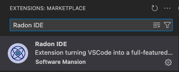
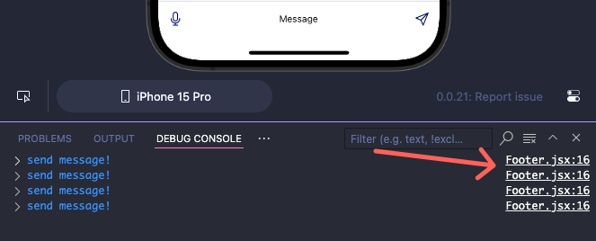
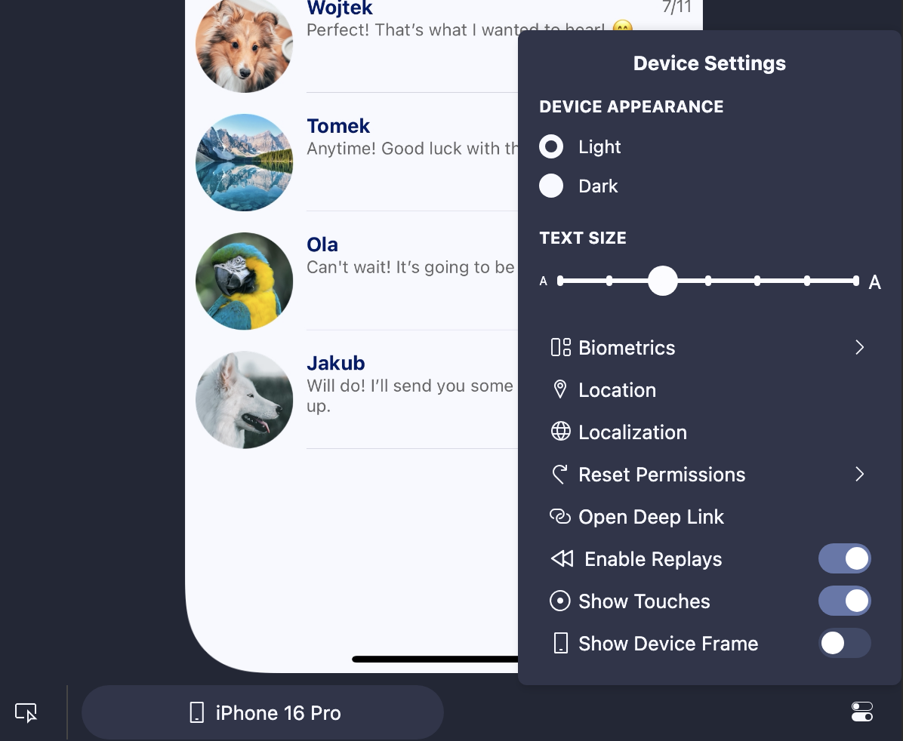

# [Radon IDE](https://ide.swmansion.com)

[Radon IDE](https://ide.swmansion.com) is an extension for VSCode and Cursor that turns your code editors into a fully-featured IDE for developing React Native and Expo apps.

### 💽 Installation and Usage

You can install Radon IDE with VSCode using the **Install** button on our [VSCode Marketplace page](https://marketplace.visualstudio.com/items?itemName=swmansion.react-native-ide).

You can also install it directly from the **Extension** tab in VSCode or Cursor.
First, open your editor, navigate to the **Extensions** tab, and search for `Radon IDE`. Then, use the **Install** button to install it:

For more installation options, you can [visit our installation guide](https://ide.swmansion.com/docs/getting-started/installation).

Once you have the IDE installed, you can check our [Getting Started Guide](https://ide.swmansion.com/docs/getting-started/launching) on how to launch and start using the extension.

### 💼 License

Radon IDE is available under commercial license that can be purchased on our website: [ide.swmansion.com](https://ide.swmansion.com/pricing).
You can use our Free Trial License to evaluate whether the extension works for your project and use cases.

Once you purchase your license, you can follow our [License Activation Guide](https://ide.swmansion.com/docs/guides/activation-manual) to activate it in using the IDE Panel in VScode or Cursor.

### ✨ What does it do

Radon IDE aims to work with all sorts of React Native and Expo project (see [project compatibility]() page for details), and without any extra configuration will build and launch your project providing an integrated simulator preview right in the editor and enabling a set of integrations that can accelerate the development process including, but not limited to:

### Element inspector with component hierarchy

<video autoPlay loop width="600" controls>
  <source src="packages/docs/static/video/ide_element_inspector.mp4" type="video/mp4"/>
</video>

### Debugger integrated with source code

<video autoPlay loop width="600" controls>
  <source src="packages/docs/static/video/3_sztudio_debugger.mp4" type="video/mp4"/>
</video>

### Logging console with jump-to-source functionality

### Device settings adjustments for theme, text size, location, system language and more...

### Screen recording and screen replays

<video autoPlay loop width="600" controls>
  <source src="packages/docs/static/video/ide_screen_recording.mp4" type="video/mp4"/>
</video>

### Component preview functionality

<video autoPlay loop width="600" controls>
  <source src="packages/docs/static/video/ide_different_previews.mp4" type="video/mp4"/>
</video>

Visit [Feature Highlights](https://ide.swmansion.com/docs/getting-started/feature-highlight) documentation page, where we showcase the most important features of the extension.

### 🐛 Troubleshooting

For troubleshooting and guide on reporting issues please visit our [Troubleshooting Docs](https://ide.swmansion.com/docs/guides/troubleshooting).

### ⚒️ Extension Development

If you want to develop the extension and contribute updates head to [Development Guide](https://ide.swmansion.com/docs/guides/development).

### 🔗 Links

Visit [Radon IDE website](https://ide.swmansion.com).

Radon IDE is built by [Software Mansion](https://swmansion.com)

