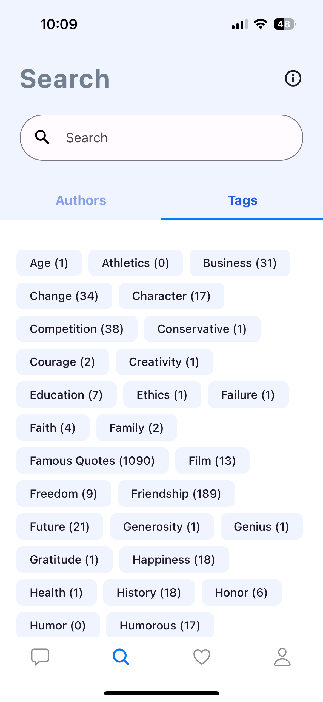

# Random Quote Generator App

A simple React Native app built with Expo that displays random quotes.

## Getting Started

### Prerequisites

Make sure you have the following installed on your machine:

- [Node.js](https://nodejs.org/)
- [npm](https://www.npmjs.com/)

### Development Setup

Run the following command:

```bash
npm install -g expo-cli
git clone https://github.com/yogeshwar-chaudhari-20/RandomQuotes
cd RandomQuotes
npm install
npm run start
```

Use your preferred method to run the app on an emulator, simulator, or physical device.

## Additional Information

For more details on Expo and React Native, refer to the following documentation:

- [Expo Documentation](https://docs.expo.dev/)
- [React Native Documentation](https://reactnative.dev/docs/getting-started)
- [Random Quotes API](https://github.com/lukePeavey/quotable)

Feel free to customize and extend the app as needed for your project! If you encounter any issues or have questions, please check the documentation or open an issue in this repository.

Happy coding!

## Screenshots

1. **Home:**
   <br/>
   

   The quote is displayed prominently in large text, and it is succeeded by the name of the author.

2. **Screenshot 2:**
   <br/>
   

   Presenting a list of authors, with the added functionality for customers to search for a specific author.

3. **Screenshot 3:**
   <br/>
   

   Expanding the list item reveals additional information, including the author's biography and the total count of quotes.

4. **Screenshot 4:**
   <br/>
   

   A list of tags is showcased along with the respective count of associated quotes.

5. **Screenshot 5:**
   <br/>
   

   Displays the quotes bookmarked by the customer.
